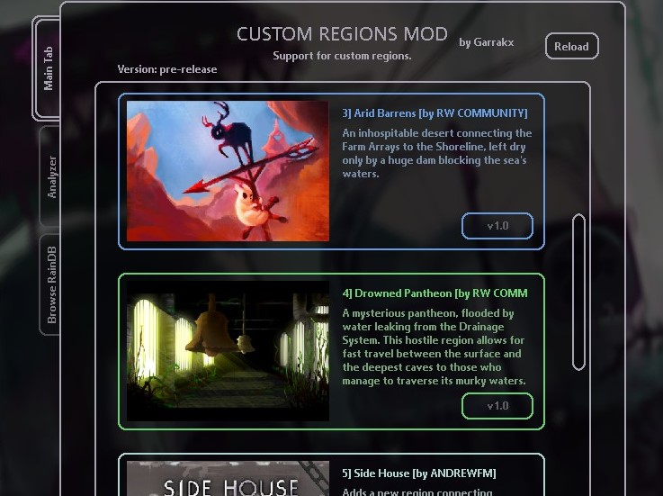

# [BETA] Custom-Regions
***
## Позволяет устанавливать новые регионы, не изменяя файлов игры напрямую, и делать некоторые другие интересные вещи. Имитирует совмещение папок модов и игры at runtime и перенаправляет соединения между комнатами.
[](https://twitter.com/garrakx)  []() [](https://github.com/Garrakx/Custom-Regions/releases/)


## Содержание
* [ЧаВО](#FAQ)
* [Установка Custom Regions](#index1)
* [Установка регионов](#index2)
* [Удаление](#index3)
* [Меню настроек](#browserScreen)
* [Как это работает?](#index4)
* [Обработка конфликтов - совмещение регионов](#index5)
* [Информация для моддеров](#index6)
	* [СТРУКТУРА ДИРЕКТОРИЙ](#folder)
	* [ОБЕСПЕЧЕНИЕ СОВМЕСТИМОСТИ](#compat)
	* [ПУБЛИКАЦИЯ](#publish)
	* [ИЛЛЮСТРАЦИИ](#art)
	* [ЭЛЕКТРО-ВРАТА](#gates)
	* [ДОБАВЛЕНИЕ ЖЕМЧУЖИН С ТЕКСТОМ (без использования кода)](#pearls)
	* [ИКОНКИ РЕГИОНОВ](#thumb)
	* [МОДИФИКАТОРЫ АЛЬБИНОСНОСТИ / ИЗМЕНЕНИЕ ЦВЕТА СУЩЕСТВ](#colors)
	* [ПРЕДМЕТЫ ДЛЯ АРЕНЫ](#arena)
* [Известные проблемы](#issues)
* [Автор(ы)](#credits)

### <a name="FAQ"></a> Часто задаваемые вопросы
* **Что такое CRS и с чем его едят?**
Custom Region Support (CRS) облегчает установку и удаление регион-модов и позволяет делать это, не изменяя файлы игры. Помимо этого, CRS автоматически совмещает подключенные регион-моды, позволяя устанавливать их в практически любых комбинациях.

* **Что такое регион-мод / регпак?**
Это мод, изменяющий имеющиеся регионы и/или добавляющий новые. Регпаки, сделанные с расчётом на устаревший метод установки (совмещение директорий вручную) может быть использован через CRS, но не наоборот.

* **Что такое регион?**
Если из комнаты А в комнату Б можно попасть, не пересекая ворота, А и Б находятся в одном регионе.

* **Установщик**
Теперь у CRS ксть меню установки регион-модов, позволяющее загружать/обновлять их в один клик и без рестарта игры. Если регпак "Недоступнен" (`Unavailable`), это значит, что автор не опубликовал его в подходящем формате.

Если вам по какой-то причине не хочется использовать установщик, создайте пустой файл `offline.txt` в `Rain World\Mods\CustomResources\`.

* **<a name = "packInfo"></a>packInfo.json**
Этот файл содержит настройки регпака.
Ключи и их значения:

  * <u>`regionPackName`</u>: Имя мода. Используется для идентификации при установке/обновлении. Пример:`"Underbelly"` (совпадение с "реальным" внутриигровым названием одного из регионов необязательно)
  * <u>`description`</u>: Описание мода, показывается в меню настроек.
  * <u>`author`</u>: имя/имена авторов.
  * <u>`activated`</u>: Определяет, будет ли регпак подключен.
  * <u>`loadOrder`</u>: Определяет положение в очереди загрузки.
  * <u>`regions`</u>: Двухбуквенные коды **новых** (отсутствующих в ванили) регионов, добавленных модом, разделённые запятыми. Пример: `"GA, MH"`. Может быть пустым, если регпак новых регионов не добавляет.
  * <u>`thumbURL`</u>: Ссылка на `.png`-файл для превью. [Подробнее](#browser).
  * <u>`version`</u>: Версия мода. CRS добавляет "v" в начало, версия `"1.5"` становится `v1.5`.
  * <u>`requirements`</u>: Описание дополнительных требований к установке. Пример: `"Для корректной работы необходимы BetterRainbows.dll и ColoredLight.dll."`
  * <u>`checksum`</u>: Контрольная сумма всех файлов региона, обновляется при загрузке, если какие-либо файлы были изменены.


* <a name="regionInfo"></a>**Разница между `packInfo.json` and `regionInfo.json`**

Раннии версии CRS использовали `regionInfo.json` вместо `packInfo.json`. Назначение файла абсолютно то же самое. При загрузке на новой версии замена происходит автоматически.

* <a name="corrupted"></a>** Повреждение сохранений** 
Подключение, отключение и изменение регион-модов повреждает сохранения. Последствия разнятся от смещения существ между логовами до вылетов при загрузке игры. Чтобы избавиться от повреждённого сохранения, сотрите его в меню настроек.


* **CRS будет работать, если я установил(а) регион-мод старым способом?**
Скорее всего, нет.

* <a name="hashPearls"></a>**Зачем к сохранённым жемчужинам прицеплен хэш?**
Чтобы избежать вылетов, связанных с сериализацией предметов.
**Технические детали**: игра сохраняет тип жемчужин (энам) как инты. Для добавления новых значений используется EnumExtender. В зависимости от активного набора регпаков, конечные значения интов после расширения типа могут разниться. Чтобы избежать непредсказуемых смещений типов и последствующих трансформаций одних жемчужин в другие, к данным сохранения жемчужин добавляется хеш, генерируемый из имени жемчужины.
Жемчужины, добавленные с помощью CRS до появления этой системы, должны быть удалены и выставлены заново для корректной работы.

* **Кто такой этот ваш RegionPackDownloader.exe?**
По техническим причинам загрузка регпаков проводится отдельной программой. Если не хотите её использовать - включайте оффлайн-режим (см. выше)

* **Что значат файлы .crpack?**
Это временный файл RegionDownloader.exe. Можно изменить расширение на `.zip` и открыть как обычный архив. Для работы не нужен.

* **Почему одна из вкладок в меню моргает?**
Моргает вкладка "Browse RainDB" == для одного из установленных регион-модов доступно обновление.
Моргает вкладка "Analyzer" == в сохранении обнаружены проблемы.
***

### <a name="index1"></a>Установка CRS

0) Сделайте резервную копию своих сохранений, если они вам дороги (`Rain World\UserData`).
1) Установите модлоадер (BepInEx или Partiality, рекомендуется BepInEx)
2) Скачайте последнюю релизную версию CRS [отсюда](https://github.com/Garrakx/Custom-Regions/releases/)
3) Примените **все** (`EnumExtender.dll`, `ConfigMachine.dll`, `CustomAssets.dll`, `CustomRegions.dll` и `AutoUpdate.dll`) моды из архива `[DOWNLOAD_THIS_Custom-Regions-vX.X.zip]`. Обновления будут производиться автоматически.

***
### <a name="index2"></a>Установка регионов

* ***Внимание: собственные инструкции большинства модов устарели. Если вы планируете использовать CRS, следуйте указаниям, приведённым ниже.**

Для установки регпака через загрузчик достаточно нажать на кнопку "загрузить" в меню настроек мода и дождаться окончания процесса.

1) Включите CRS, запустите игру как минимум один раз. Если всё сделано правильно, в `Rain World\Mods` появится директория `CustomResources`.
2) Создайте в `CustomResources` папку для нужного вам регион-мода (пример: `Rain World\Mods\CustomResources\Underbelly`).
3) Внутри этой папки поместите содержимое архива с регионом. Правильная структура поддиректорий:
	```
	├──Mods\CustomResources\
	│          └──Underbelly\
	│                ├── Assets
	│                ├── Levels
	│                ├── World
	¦                ¦
	```
4) Если регпак делался с расчётом на установку через CRS, в архиве должен быть файл `packInfo.json`. Если нет, CRS создаст его при запуске. Этот файл может быть открыт в любом текстовом редакторе (например, Notepad). Значения полей смотрите [здесь](#packInfo). Как правило, вас будут интересовать два из них - `loadOrder` и `activated`. **Редактирование любого из них, ровно как и добавление/удаление регпаков, приводит к повреждению сохранений.** Будьте осторожны.

В меню настроек установленные регион-моды отображаются в порядке загрузки, отключенные помечены красным.

### <a name="index3"></a>Деинсталляция регионов (два варианта)
Вариант 1). Откройте `Rain World\Mods\CustomResources\Your Region\regionInfo.json` и установите флаг `activated` на `false`.
Вариант 2). Удалите папку, созданную на шаге 2 (`i.e. Rain World\Mods\CustomResources\Underbelly`)

***
### <a name="browserScreen"></a>Меню настроек 
В меню CRS (доступно из меню настроек игры, Options -> Mod config) есть 3 вкладки:
1) Установленные регпаки - показывает все установленные регпаки в порядке загрузки, и включен ли каждый из них.
2) Анализатор сохранений - показывает возможные проблемы с текущим сохранением. Вывод может быть неточным.
3) "Browse RainDB" - показывает доступные для скачивания/обновления регпаки. [Подробнее](#browser)


***
### <a name="index4"></a>Как это работает?

Изначально большая часть регион-модов делалась с расчётом на установку посредством совмещения директорий. Это ограничивало совместимость и усложняло деинсталляцию.

CRS загружает регпаки из отдельных директорий и пытается совместить изменения, избегая конфликтов, следующим образом:

При совмещении ванильного файла world_XX
	```
	Vanilla world_xx.txt
	[...]
	ROOM1 : ROOM2, ROOM3
	ROOM2 : ROOM4, ROOM1
	ROOM3 : ROOM1
	ROOM4 : ROOM2, DISCONNECTED
	ROOM5 : ROOM6, ROOM7, ROOM8
	[...]
	```
с world_XX из мода 1:
	```
	[...]
	ROOM1 : ROOM2, DISCONNECTED
	ROOM2 : ROOM4, ROOM1
	ROOM3 : DISCONNECTED
	ROOM4 : ROOM2, SHELTER1
	SHELTER1 : ROOM4
	[...]
	```
Результат выглядит следующим образом:

	```
	[...]
	ROOM1 : ROOM2, DISCONNECTED
	ROOM2 : ROOM4, ROOM1
	ROOM3 : DISCONNECTED
	ROOM4 : ROOM2, SHELTER1
	SHELTER1 : ROOM4
	ROOM5 : ROOM6, ROOM7, ROOM8
	[...]
	```
Соединения из модов берут приоритет над ванильными и полностью их замещают.

***
### <a name="index5"></a>Обработка конфликтов
CR попытается совместить все изменения, добавляемые в регион, и достичь совместимости:


Если world_XX.txt мода 1 выглядит так:
```
A: C, B, DISCONNECTED
B: A, DISCONNECTED
C: A
```
а world_XX.txt мода 2 так:
```
A: DISCONNECTED, B, C
B: A, DISCONNECTED
D: A
```
CRS совместит их, и результат будет эквивалентен следующему:
```
A: C, B, D
B: A, DISCONNECTED
C: A
D: A
```

***
### <a name="index6"></a>Информация для моддеров
* CR сравнивает все переходы между комнатами. Если ваше соединение накладывается на ванильное, (в случае, если ваш мод загружается первым либо является единственным подключенным), вашему соединению присваивается абсолютный приоритет и оно всегда заменяет ванильное.
```
Analyzed room [SB_J01 : DISCONNECTED, SB_E02, SB_G03, SB_C07 : SWARMROOM]. Vanilla [True]. NewRoomConnections [SB_ROOTACCESS, SB_E02, SB_G03, SB_C07]. IsBeingReplaced [True]. No Empty Pipes [True]
```
* Если ваш мод изменяет комнату, которая добавлена либо уже изменена другим модом, CR попытается совместить правки
```
Replaced [SB_J03 : DISCONNECT, SB_J02, SB_F01, SB_S02] with [SB_J03 : SB_ROOTACCESS, SB_J02, SB_F01, SB_S02]
```
* Если комната, для которой CR пытается осуществить совмещение, не имеет отключенных выходов (DISCONNECTED), регионы несовместимы.
```
ERROR! #Found incompatible room [SB_J01 : SB_Q01, SB_E02, SB_G03, SB_C07] from [AR] and [SB_J01 : SB_ROOTACCESS, SB_E02, SB_G03, SB_C07 : SWARMROOM] from [TR]. Missing compatibility patch?
```
### <a name="folder"></a>СТРУКТУРА ДИРЕКТОРИЙ
* Чтобы создать структуру директорий вашего мода, просто имитируйте структуру директорий игры, как если бы вы собирались создавать мод, устанавливающийся прямым совмещением. **ВАЖНО:** Если вы хотите отключить соединение, активное в ванили, вам необхожимо обозначить выход как "DISCONNECTED".

* Как удалить ванильное соединение

Допустим, фрагмент world_XX.txt некоторого региона в ванили выглядит так:
	```
	A: C, B, D
	```
Если вам необходимо отключить соединение A с C, соответствующая строка в вашем world_XX.txt должна выглядеть так:
	```
	A: DISCONNECTED, B, D
	```

### <a name="compatibility"></a>ОБЕСПЕЧЕНИЕ СОВМЕСТИМОСТИ

* Наглядный пример, иллюстрирующий добавление одной комнаты в HI (Промкомплекс) (создано LeeMoriya). [Нажмите сюда](https://discordapp.com/channels/291184728944410624/431534164932689921/759459475328860160)

1)	Создайте мод, загружающийся первым и изменяющий ванильную комнату, добавляя новые точки соединения в HI_A07:

	Так должен выглядеть *весь* файл world_HI.txt мода NewPipes (необходимы только эти строки)
	```
	ROOMS
	HI_A07 : HI_A14, DISCONNECTED, DISCONNECTED, HI_B04, HI_C02
	END ROOMS
	```
	
	*примечание:* Вам может понадобиться подвигать DISCONNECTED туда-сюда, чтобы найти раскладку, при которой ванильные соединения остаются на своих местах.

2)	Создайте ещё один регион-мод, присоединяющий дополнительную комнату к HI_A07, но загружающийся после NewPipes

	Так должен выглядеть *весь* файл world_HI.txt регион-мода ModA
	```
	ROOMS
	HI_A07 : HI_A14, HI_B04, HI_C02, HI_MODA, DISCONNECTED
	HI_MODA : HI_A07
	END ROOMS
	```
3)	Создайте третий мод, который также соединяется с HI_A07, и также загружается после NewPipes
Так должен выглядеть *весь* world_HI.txt мода ModB
	```
	ROOMS
	HI_A07 : HI_A14, HI_B04, HI_C02, DISCONNECTED, HI_MODB
	HI_MODB : HI_A07
	END ROOMS
	```


### <a name="publish"></a>Публикация для загрузчика
CRS получает данные о регпаках [отсюда](http://garrakx.pythonanywhere.com/raindb.json).

Если вы хотите опубликовать свой регпак для использования через загрузчик, сделайте следующее:

0)	Убедитесь, что закончили работу с регпаком.
1)	Откройте `packInfo.json` в текстовом редакторе.
2)	Очистите поле `checksum` (измените строку на `checksum: ""`). Запустите игру снова. В поле будет сгенерирована новая контрольная сумма. Сохраните её в надёжном месте.
3)	Упакуйте ваш регион-мод в `.zip`-архив. Внутренняя структура *должна* соответствовать образцу:

	```
	├─Underbelly.zip
	│   ├── Assets
	│   ├── PackDependencies
	│   ├── Levels
	│   ├── World
	¦   ¦
	```
4)	Если вашему регион-мод требует дополнительных `.dll` файлов, поместите их в `[Ваш регион].zip\PackDependencies`. При установке регпака CRS автоматически помещает их в активную директорию используемого модлоадера (если пользователь загружает игру через Partiality, ему необходимо будет вручную применить скачанные моды).
5)	Выгрузите архив на [mediafire.com](https://www.mediafire.com/). По техническим причинам, это единственный сервис, который можно использовать для этой цели.
6)	Выйдите на контакт с Garrakx (автор мода), передайте название мода, ссылку на файл (пример: `https://www.mediafire.com/file/abunchofcharacters/RegionPackName.zip/file`) и контрольную сумму с шага 2.


### <a name="art"></a>Иллюстрации

* Для использования иллюстраций, помимо "`positions.txt`" вам понадобится файл "`depths.txt`", где необходимо будет обозначить глубину слоёв. Порядок слоёв тот же, что и в "`positions.txt`".
* Вы можете добавить произвольное количество слоёв.
* После обновления 0.6 может понадобиться повторная настройка расположения.
* Вы можете двигать слои, зажав `N`. Чтобы записать изменения в файл, нажмите `B`. Чтобы загрузить изменения из файла, не перезапуская игру, нажмите `R`.

### <a name="gates"></a>ЭЛЕКТРО-ВРАТА
* Чтобы сделать любое количество добавляемых вами ворот электрическими, в папке `Gates` директории вашего мода (рядом с `locks.txt`) создайте файл `electricGates.txt`. Используя формат, сходный с таковым в `locks.txt`, укажите названия всех ворот, которые должны стать электрическими, и высоты батарей:
```
GATE_SB_AR : 558
```
(`Rain World\Mods\CustomResources\"Your Region"\World\Gates\electricGates.txt`)
### <a name="pearls"></a>ЖЕМЧУЖИНЫ С ТЕКСТОМ

CR добавляет возможность вводить в игру новые жемчужины с текстом без использования кода, и даже добавлять новые диалоги. Делается это следующим образом:

1.	Перейдите в папку `Rain World\Mods\CustomResources\"your region name"\Assets\`. Создайте текстовый файл под названием `pearlData.txt`. Этот файл определяет данные для создания новых жемчужин и делает последние доступными в меню установки объектов.

2.	Внутри `Rain World\Mods\CustomResources\"your region name"\Assets\pearlData.txt`, обозначьте данные жемчужин в следующем формате (тщательно проверяйте соответствие, все пробелы должны быть на месте):

	```
	1 : first_pearl_name : mainColorInHex : highlightColorInHex
	2 : another_pearl_name : mainColorHex2 : highlightColorInHex
	3 ...
	```

	* Первое число определяет numberID жемчужины (позже вы используете его для добавления файла диалога). 
	* Второе поле - имя, которое будет отображаться для жемчужины в меню установки объектов, может быть любым (например: `root_pearl_CC`)
	* Третье поле - цвет жемчужины в шестнадцатеричном формате (например, `00FF00` для ярко-зелёного, используйте любой инструмент выбора цветов). 
	* Четвёртое задаёт вторичный цвет, которым она будет периодически подсвечиваться.

3.	Запустите игру и убедитесь, что ко всем строкам жемчужин добавлено новое поле. Если вы расставили жемчужины по комнатам до появления этого поля, удалите их и выставите заново. [Подробнее](#hashPearls)

*Если вы хотите добавить жемчужины без текста, можете остановиться здесь. Если вам необходимо добавить к жемчужинам реплики Луны, продолжайте следовать инструкциям*.


4.	Перейдите в `Rain World\Mods\CustomResources\"your region name"\Assets\Text\Text_Eng\`. Для каждой жемчужины, которой вы хотите добавить уникальные диалоги, создайте свой текстовый файл. Используя приведённый выше пример, если вы хотите добавить диалог для жемчужины *first_pearl_name*, вам необходимо создать текстовый файл `1.txt` (номер, соответствующий идентификатору жемчужины из первого поля). Откройте файл и поместите туда необходимый текст. ***НЕ ИСПОЛЬЗУЙТЕ ЗДЕСЬ ИСХОДНЫЕ ФАЙЛЫ; СДЕЛАЙТЕ РЕЗЕРВНУЮ КОПИЮ!***

Пример:
	```
	0-46
	Первая строка в первом окне диалога.<LINE>Вторая строка в первом окне диалога.
	
	Это первая строка второго окна диалога!
	```
	Из моддинг-вики:

	`Первая строка файла должна иметь вид **0-##**, где **##**  - номер файла.`

Поддерживается локализация кастомных жемчужин. Чтобы добавить переводы, поместите текст в сходном формате в соответствующую языковую папку (Text_Fre, Text_Ger, Text_Rus и т.д.). Если вы не планируете добавлять локализацию, просто скопируйте туда текст на английском, чтобы избежать вылетов.

5.	Запустите игру (естественно, CR должен быть подключен). Игра зашифрует файлы диалогов, чтобы затруднить дата-майнинг. Поставляйте эти зашифрованные файлы в комплекте с вашим модом.

### <a name="thumb"></a>ИКОНКИ МЕНЮ

* Игра проверяет, существует ли файл `thumb.png` рядом с `regionInfo.json` (разрешение должно быть равно 360x250 px).
* Если иконки нет, игра попытается загрузить её с raindb.net (то же самое происходит с описаниями).
* Если автозагрузка по какой-то причине не работает, свяжитесь с авторами.

### <a name="colors"></a>АЛЬБИНОСНОСТЬ / ЦВЕТА СУЩЕСТВ

CRS позволяет настраивать цвета некоторых существ (водоросли, долгоноги, левиафаны, каракатицы). Чтобы использовать эту фичу:

* Скачайте [этот файл](https://github.com/Garrakx/Custom-Regions/blob/master/Example%20Config%20Files/CustomConfig.json) и поместите его рядом с вашим world_XX.txt. Пример: `Rain World\Mods\CustomResources\"Your Region"\World\Regions\"RegionInitials"\`(Если хотите изменить настройки ванильного региона, создайте пустую директорию с его кодом в вашем регпаке и поместите туда только CustomConfig.json).
* Цвета указываются в hex-формате (00FF00).
* Пустая строка ("") означает, что будут использоваться стандартные параметры.
* Шанс появления чёрных саламандр (`"black_salamander_chance"`) - число между нулём и единицей (пример: `0.3`) и устанавливает вероятность того, что саламандра из региона получит тёмный окрас при спауне. 1 = стопроцентный шанс (все саламандры чёрные).


### <a name="arenaUnlock"></a>Добавление разблокируемых уровней арены

1. Создайте файл `customUnlocks.txt` в `/PackFolder/Levels/`, рядом со всеми вашими аренами.
2. Внутри этого файла обозначьте все разблокируемые уровни в следующем формате: `ИДЕНТИФИКАТОР_АНЛОКА : АРЕНА1, АРЕНА2`
	Пример:
	```
	RW1 : Mycelium, Tower
	RW2 : Arena2, Arena3, Arena4
	```
3. Установите объекты `ArenaUnlock` через Devtools.

В каждом регионе может быть несколько разблокируемых уровней.

***
### <a name="index7"></a>Известные проблемы

* Из-за особенностей работы системы сохранений подключение / отключение регион-модов требует от пользователя использования свежей ячейки сохранения.
* Загрузчик может периодически обрывать установку регпаков. Если это случается, попробуйте заново.
* Автокарта часто ломается.

***
### <a name="index8"></a>Благодарности

Баннер - [Classick](https://classick-ii.tumblr.com/post/634237640578859008/boopbeep).
Помощь и идеи - LeeMoriya.
Идея вынести загрузчик в отдельный процесс - Slime_Cubed.
Чистка репозитория для облегчения коллаборации - dual curly potato noodles.
Плейтесты - Carrotpudding, LB, Precipitator, Stero, Laura.
Переводы - Thalber (RU), LB (FR).
