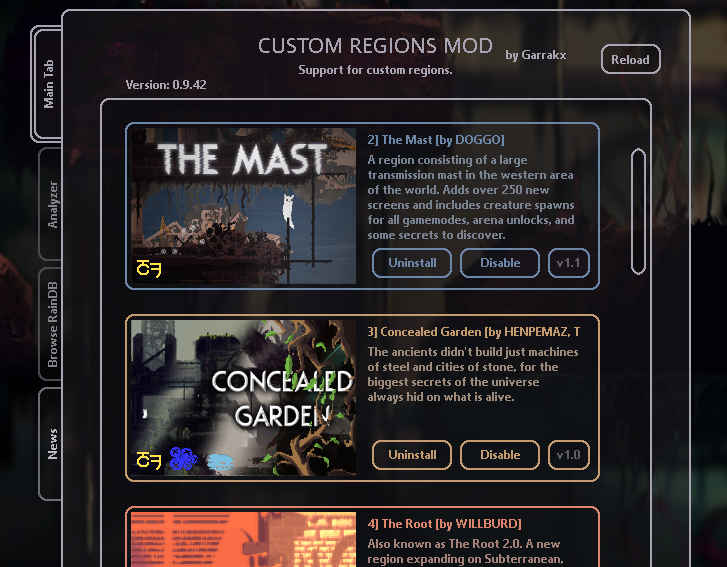
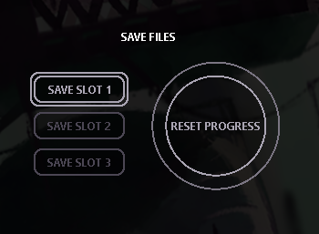
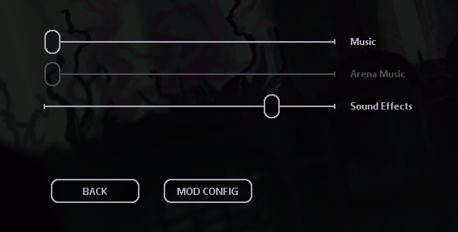

## Warning! You are seeing the *legacy* version of CRS (Rain World v1.5), for the Downpour/RW v1.9, please visit [here](https://github.com/Garrakx/Custom-Regions/tree/dp-release)!
***
# Custom Regions Support
***
## Lets you install and browse region packs without modifying the base game's files and more. It works by automerging the world files at runtime and rerouting accesses to rooms
[](https://twitter.com/)  []() [](https://github.com/Garrakx/Custom-Regions/releases/latest)
[](https://ko-fi.com/garrakx)


Read this in other languages: [Spanish (soon) ](./README-ES.md), [Russian ](./README-RU.md) and [French ](./README-FR.md)

## <a name="index"></a>Index

1) [Introduction and FAQ](#FAQ)
2) [Installing the CRS Mod](#index1)
3) [Installing a Region Pack](#index2)
4) [Uninstalling a Region Pack](#index3)
5) [CRS Pack Screen](#browserScreen)
6) [How does it work?](#index4)
7) [Region merging](#index5)
8) [For modders:](#index6)
    * [FOLDER STRUCTURE](#folder)
    * [COMPATIBILITY BETWEEN TWO PACKS](#compatibility)
    * [PUBLISH YOUR PACK](#publish)
	* [*(new)* CONDITIONAL LINKS](#links)
	* [*(new)* CONNECTION FIXER](#fixer)
    * [REGION ART](#art)
    * [ELECTRIC GATES](#gates)
    * [CUSTOM DATA PEARLS](#pearls)
    * [THUMBNAILS](#thumb)
    * [ALBINO / COLORED CREATURES](#colors)
    * [ARENA UNLOCKS](#arenaUnlock)
	* [*(new)* REMOVING CREATURE SPAWNS](#spawns)
	* [CUSTOM MUSIC AND AMBIENT SOUNDEFFECTS](#music)
9) [Suggestions](#suggesting)
10) [Known issues](#issues)
11) [Credits](#credits)
12) [Donate](#donate)
13) [Changelog](#changelog)
***

### <a name="FAQ"></a>Introduction and FAQ

* **What's Custom Regions Mod?**  
Custom Regions Support (aka `Custom Regions Mod` or simply `CRS`) main goal is to install custom modded regions without altering the game files. This means that the installation is more straightforward and uninstallation is now possible. Additionally, CRS merges region packs so you can install multiple at the same time.
* **What's a region pack?**  
A region pack (or just pack) is a mod that contains one or more modded regions, or alternatively, just modifications to vanilla regions. This means a pack could add two new regions to the game, and also modify the existing vanilla regions.
In terms of compatibility, any region pack made with the outdated method of merging with the vanilla files will work with CRS. On the other hand, making a region pack specifically brings improvements that were not possible before.
* **What's a region?**  
Yes, I know this is obvious but let's go over the definition: a region is a compilation of rooms, separated by gates, which has a two-letter acronym, and it's own `world_XX.txt` file. A region pack can include several regions.
* <a name="browser"></a>**The in-game pack browser**  
New in the latest updates, CRS adds an in-game region pack browser that let's you install region packs with just one click without even closing the game. If a pack is marked "unavailable", it means the author has not contacted me (Garrakx) to make the necessary arrangements to make their pack available, so let them know.
* **How to run the mod in offline mode**  
If you don't want the online features of CRS (pack downloader, pack info fetcher, thumb downloader...) you can place a empty text file called `offline.txt` in your resource folder (`Mods\CustomResources\`).
* <a name="packInfo"></a>**What's `packInfo.json`**  
This file contains information about the region pack. After you have made any modifications, you can restart the game to see the effects or use the `RELOAD` button located in the config screen / pack overview screen.
  * <u>`regionPackName`</u>: Name of the region pack. It's used as an identifier so it should always be the same and it shouldn't include any version numbers. For example:`"Underbelly"` (note: it doesn't have to match any in-game regions)
  * <u>`description`</u>: Provide a description for your region pack, will appear in the config screen.
  * <u>`author`</u>: Name(s) of the region pack creators.
  * <u>`activated`</u>: Whether the pack is activated or not.
  * <u>`loadOrder`</u>: It determines (relatively to other packs) the order in which this region pack will be loaded. 
  * <u>`regions`</u>: Two-letter acronym of the **new** (not present in vanilla) regions that this pack includes, separated by commas. For example: `"GA, MH"`. **Note:** your pack might not include any new regions if it is only meant to modify the vanilla regions.
  * <u>`thumbURL`</u>: Link to a png file which will be used in the CRS overview screen (the config screen). [More info](#browser).
  * <u>`version`</u>: The version of the pack. CRS will add "v" before what appears here, so `"1.5"`will be shown as `v1.5`.
  * <u>`requirements`</u>: A written description of any additional dll requirements this pack needs. `"Requires BetterRainbows.dll and ColoredLight.dll."`
  * <u>`checksum`</u>: Unique string of characters and numbers generated from all the `Properties.txt` and `world_xx.txt` files. This means that if any of these files is altered or deleted, or if you add new files, the checksum will change. It is used to see if the region pack has received any modifications. This field is updated everytime you reload/refresh the region packs.
  * (***new***)<u>`useRegionName`</u>: If `true`, the first Subregion from the `Properties.txt` file will be disaplyed in the continue save menu. If `false` (default), the pack name will be displayed instead.
* <a name="regionInfo"></a>**Difference between `packInfo.json` and `regionInfo.json`**  
In recent versions of CRS, the `regionInfo.json` file was upgraded to `packInfo.json`. The purpose is the same, just a change of name to unify the naming of region packs. If you are coming from a version that used the old file, it should get upgraded automatically.
* <a name="corrupted"></a>**Corrupted saves**  
After you change any room connections, you change the order in which the packs are loaded or you activate / deactivate any region packs, your file will be corrupted. In the best case scenario, creature dens and objets will be misplaced. In the worst case, you will not be able to load the game at all. To fix this, you have to reset progress of the save slot from the options menu. `@Deltatime` made a mod that tries to fix this issue, but it is not full completed so it might have some issues. You can download the latest version [here](https://discord.com/channels/291184728944410624/481900360324218880/826151202923872326) (you have to install it before installing any regions).  

* **Can I use CRS with a modified Rain World install? (merged regions)**  
Short answer: no.
Long answer: Maybe. Currently, CRS expects to have a clean installation, so things might not work as expected when you have merged region files. It is recommended that you verify your game files before using CRS.
* <a name="hashPearls"></a>**What's the hash pearl data?**  
CRS and other mods use Enum Extender to add new Data Pearls. However, the integer assigned to each enum depends on the system and which regions you have installed. Unfortunately, Rain World saves the pearl data ID as an integer. This means that, for example, installing a new region can cause the pearls to be shifted while loading (instead of loading The Mast pearls, the game might load Underbelly pearls). Furthermore, I could not save the pearl name as a string because this would mean that a person using the pack without CRS would crash its game (because it was expecting and integer and not a string, and the vanilla game doesn't handle this error). The solution to this was creating a hash value of the pearl name (which is an integer), and using it as an identifier to load the pearl. This hash is saved into a file because generating it from the same string on different system not always results in the same value. Any region packs distributed before this update (without the hash) will need to remove all data pearls (using devtools) and place them again, following the updated instructions below.
* **What's RegionPackDownloader.exe?**  
For technical reasons, the downloading and unzipping process is done by a separate program. If you don't want to use this program, just run CRS in offline mode (see above).
* **What's `(packName).crpack`?**  
This is a temporal file used by the RegionDownloader.exe. You can change the extension to .zip and open it, you will see it is just the zipped pack. You can safely delete this file if you want to.
* **Why is the tab blinking?**  
If it is the browser tab, it means you have an updated available for a pack. If it is the analyzer tab, it means it found an error.

***
### <a name="index1"></a>Installing the CRS Mod

1) BEFORE USING ANY MODS, MAKE A BACK UP OF YOUR SAVES (located in the `Rain World\UserData` folder)
2) Download and install a Rain World Modloader. BepInEx is recommended. **Video tutorial** by *LeeMoriya*: [click here](https://youtu.be/brDN_8uN6-U).
3) Download the latest CRS release from [here](https://github.com/Garrakx/Custom-Regions/releases/latest).
4) Apply **all** (`CustomRegions.dll`, `EnumExtender.dll`, and finally `ConfigMachine.dll`) mods inside [DOWNLOAD_THIS_Custom-Regions-vX.X.zip](https://github.com/Garrakx/Custom-Regions/releases/latest) file. You will receive updates automatically. (Note: CustomAssets.dll is no longer required).
5) You are done!

***
### <a name="index2"></a>Installing a Region Pack

 ***Attention:** Most instructions from the modded regions are outdated. If you want to use Custom Regions Mod, you should follow these instructions.*

There are two ways of installing region packs:
* `Automatic installation (recommended)` Installing using the in-game browse:
	1) Open the game and go to the Config Machine menu (click [here](#browserScreen) if you don't know what it is)
	2) Click on the `"Browse RainDB"` tab.
	3) Pick the pack you want to download and hit download.
	4) If the pack had dependencies, you will have to restart the game.
* `Manual`

	1) Run the game once with CRS installed and activated. If everything went well, you should see a new folder inside Rain World\Mods called "`CustomResources`".
	2) Create a new folder inside Rain World\Mods\CustomResources with the name of your region pack (i.e. `Rain World\Mods\CustomResources\Underbelly`).
	3) Inside this folder (i.e. `Underbelly`) you must place the "`World`", "`Assets`" and / or "`Levels`" folders from the region pack you are installing.
	**Note:** Make sure inside this folder there is not a intermediate folder!

		```
		Correct folder structure:
		├──Mods\CustomResources\
		│          └──Underbelly\
		│                ├── Assets
		│                ├── Levels
		│                ├── World
		¦                ¦
		```

	4) If the region pack was made with CRS in mind, it should come with a file caled `packInfo.json` (previously known as `regionInfo.json`, [click here](#regionInfo) for more info). If it doesn't come with it, Custom Regions Support should create it for you. You can open this file with any file editor (try notepad). If the file was included with the region pack, the only fields you need to worry about are:
		* `activated`: If true, it means the region pack is activated and will be loaded. Set it to false to disable the pack.
		* `loadOrder`: It determines (relatively to other packs) the order in which this region pack will be loaded. You should only change it if you know what are you doing, or if you are having incompatibilities.
		
		**WARNING: Making any modifications to any of this two fields (as well as installing or uninstalling new regions) will corrupt your save, and you will have to reset progress from the game's options menu**. [More info](#corrupted)

	5) If you go to the config screen aka CRS pack overview, you can see the order in which pack are loaded and if they are enabled (disabled regions will appear with a dark thumbnail, in red, and a "disabled" label).

##### HELP MY GAME BROKE!
If something went wrong, try these steps:
* If you have installed several region packs, you might be missing a Compatibility Patch. You can navigate to the `CustomResources` folders and inside each region pack you might find a README with more instructions.
* If you are savvy enough, you can try opening `customWorldLog.txt` (next to the game .exe). It is verbose enough you can try understanding what went wrong.
* If you need assistance, joing the official Rain World server (click [here](https://www.discord.gg/rainworld)) and ping @garrakx in `#modding-support`. You will need `customWorldLog.txt` and `exceptionLog.txt`, both located next to the game executable (Default path: `C:\Program Files (x86)\Steam\steamapps\common\Rain World`)

***
### <a name="index3"></a>Uninstalling a Region Pack (three options, pick one)
* Option a) Uninstall the pack using the Config Menu.

* Option b). Go to `Rain World\Mods\CustomResources\Your Region\packInfo.json` and set activated to false.

* Option c). Delete the folder created in step 2 (`i.e. Rain World\Mods\CustomResources\Underbelly`)

***
### <a name="browserScreen"></a>CRS Pack Screen
Inside the Config Machine's screen (acessed through the game's options menu) you will find the Pack Browser viewer. This menu has 3 tabs:

   1) Current installed packs: Tells you which region packs are currently installed, in which order and if they are activated / deactivated.
   2) Installation / save analyzer: This is used to give you some information about your save and your installation. It should be used only as a guide since its information might not be accurate.
   3) RainDB Browser: An online browser that displays available region packs. [More info](#browser)

	Accesing the config screen



***
### <a name="index4"></a>How does it work?

Before CRS, the only way of installing region packs was by merging the modded files with the vanilla installation, altering the game files. This resulted in poor compatibility between region packs, and the only way of uninstalling packs was reinstalling the whole game.

CRS loads multiple region packs from an external browser, and merges them in runtime following this:

1) First, CRS loads the vanilla world files.
2) Then, it loads the first region pack (the one with the lower load order). If this pack adds new connections, they will be appended to the vanilla ones. On the other hand, if this pack has connection that conflicts with the vanilla game, it will overwrite the vanilla one with the one added from the pack. This means that you can change any connection.
	```
	Vanilla world_xx.txt
	[...]
	ROOM1 : ROOM2, ROOM3
	ROOM2 : ROOM4, ROOM1
	ROOM3 : ROOM1
	ROOM4 : ROOM2, DISCONNECTED
	ROOM5 : ROOM6, ROOM7, ROOM8
	[...]
	```
	```
	First region pack world_xx.txt
	[...]
	ROOM1 : ROOM2, DISCONNECTED
	ROOM2 : ROOM4, ROOM1
	ROOM3 : DISCONNECTED
	ROOM4 : ROOM2, SHELTER1
	SHELTER1 : ROOM4
	[...]
	```
	As we can see, the region pack is modifying the connections of ROOM1, ROOM3 and ROOM4, and adding a new connection (SHELTER1).
	```
	Merged world_xx.txt
	[...]
	ROOM1 : ROOM2, DISCONNECTED
	ROOM2 : ROOM4, ROOM1
	ROOM3 : DISCONNECTED
	ROOM4 : ROOM2, SHELTER1
	SHELTER1 : ROOM4
	ROOM5 : ROOM6, ROOM7, ROOM8
	[...]
	```
	CRS has overwritten the ROOM1, ROOM3 and ROOM4 connections, and added the new one SHELTER1.
3) **Important:** After a vanilla connection has been merged, any following packs will try to merge instead of overwriting it. In the example above, we can see that the connection of ROOM5 was not altered by the first region pack, so it is still considered vanilla. This means that if the second region pack modifies it, it will overwrite it. On the other hand, if the second pack tries to modify the ROOM3 connections, since it was altered by the first pack, it is no longer considered vanilla so it will be merged instead of overwritten.

***
### <a name="index5"></a> Connection merging

The mod will try to merge all the region packs so they are compatible:
  
If the world_XX.txt file of Mod 1 looks like:

```json
A: C, B, DISCONNECTED
B: A, DISCONNECTED
C: A
```

and the world_XX.txt file of Mod 2 looks like:

```json
A: DISCONNECTED, B, C
B: A, DISCONNECTED
D: A
```

Custom Regions Support will merge both files and it will look like this:

```json
A: C, B, D
B: A, DISCONNECTED
C: A
D: A
```

***
### <a name="index6"></a>Useful information for modders
* *(new)* RELOADING / RESETTING CRS IN-GAME:

	While using DevTools, pressing `SHIFT+R` will reload the game and also all packs.
* CR will compare each room connection. If your room connection is being compared to a vanilla connection (i.e. it is the first one to load or the only one installed), it will replace completly the vanilla connection with the modded one.

```
Analized room [SB_J01 : DISCONNECTED, SB_E02, SB_G03, SB_C07 : SWARMROOM]. Vanilla [True]. NewRoomConnections [SB_ROOTACCESS, SB_E02, SB_G03, SB_C07]. IsBeingReplaced [True]. No Empty Pipes [True]
```

* If the mod is modifying a room that is either modded or modified by another mod, CR will try to merge both

```
Replaced [SB_J03 : DISCONNECT, SB_J02, SB_F01, SB_S02] with [SB_J03 : SB_ROOTACCESS, SB_J02, SB_F01, SB_S02]
```

* If the room CR is trying to merge doesn't have any DISCONNECTED exits, the two region packs will be incompatible.

```
ERROR! #Found incompatible room [SB_J01 : SB_Q01, SB_E02, SB_G03, SB_C07] from [AR] and [SB_J01 : SB_ROOTACCESS, SB_E02, SB_G03, SB_C07 : SWARMROOM] from [TR]. Missing compatibility patch?
```

### <a name="folder"></a>FOLDER STRUCTURE

* To create the folder structure for you region, just follow the Vanilla structure and create the mod as if you would install it merging files. **Important** If you want to delete a vanilla connection, you must put "DISCONNECTED".

* How to delete a vanilla connection

	If the vanilla world_XX.txt looks like:

	```
	A: C, B, D
	```
	
	you want to delete a connection, you must put in your modded world_XX.txt file the following:

	```
	A: DISCONNECTED, B, D
	```

### <a name="compatibility"></a>HOW TO ADD COMPATIBILITY BETWEEN TWO REGION PACKS THAT MODIFY THE SAME ROOM

1) Create a region pack that it is loaded first and modifies a vanilla room by adding new connections:
	how the *whole* world_HI.txt from the region NewPipes looks (you only need these lines)

	```
	ROOMS
	HI_A07 : HI_A14, DISCONNECTED, DISCONNECTED, HI_B04, HI_C02
	END ROOMS
	```

	*note* You might have to move around the DISCONNECTED to make sure the vanilla rooms maintains the same layout.

2) Create another region that connects to the vanilla room, but loads after NewPipes
	how the *whole* world_HI.txt from the region PackA looks like

	```
	ROOMS
	HI_A07 : HI_A14, HI_B04, HI_C02, HI_MODA, DISCONNECTED
	HI_MODA : HI_A07
	END ROOMS
	```

3) Create another region that connects to the vanilla room, but loads after NewPipes
	how the *whole* world_HI.txt from the region PackB looks like

	```
	ROOMS
	HI_A07 : HI_A14, HI_B04, HI_C02, DISCONNECTED, HI_MODB
	HI_MODB : HI_A07
	END ROOMS
	```


### <a name="publish"></a>HOW TO MAKE YOUR PACK AVAILABLE IN THE IN-GAME BROWSER
CRS will fetch and update the local description, thumbnail and author from the following [link](http://garrakx.pythonanywhere.com/raindb.json). If your region is missing or has the wrong information, [contact me](https://twitter.com/garrakx). If you want your pack to be available to download, you have to do the following:

1) Once you are sure the files are final and correct, close the game and open `packInfo.json`. 
2) Delete all the number and strings from the checksum filed (just leave `"checksum": ""`). After you run the game again, CRS will generate a new checksum that represents the current state of the files ([click here](#packInfo) for more info about the fields in packInfo.json). Write this number down.
3) Make a zip (make sure it is .zip) with all the files needed for the user. The name of the zip **must be** an exact match of the region pack name. Make sure between the zip and the content folders (`World`, `Assets`, etc) there is no intermediate folder:

	```
	├─Underbelly.zip
	│   ├── Assets
	│   ├── PackDependencies
	│   ├── Levels
	│   ├── World
	¦   ¦
	```
	
4) If your pack requires additional .dll files, place them in the `PackDependencies` folder. CRS will automatically move them to either plugin folder (if the user is using BepInEx) or to the Mods folder.
5) Upload your file to [mediafire.com](https://www.mediafire.com/) (a free account is required). For technical reasons, Mediafire is the only site that was compatible.
6) Contact me with the download link (i.e. `https://www.mediafire.com/file/abunchofcharacters/RegionPackName.zip/file`) and **send me the `packInfo.json` file**.

### <a name="links"></a>*(new)* CONDITIONAL ROOM LINKS
In the vanilla game, you can wire your region depend on which character is being played (same as with CREATURE spawns). With CRS, you can also configure your connections based on which regions are installed.
* To make your room depend on character difficulties, you include using parenthesis and separated by commas, the characters in which the connection will appear. You can indicate multiple difficulties (`(0, 1)roomA : roomB`)
#### **Examples**:
For example, if you want to make a connection that only appears for survivor:


	ROOMS
	[...]
	(0)roomA : roomB, roomD
	[...]
	END ROOMS
* To make your room depend on region installed, you include using parenthesis and separated by commas, the required regions that must be installed for this connection to appear. If you want the opposite, for a connection to appear only if you do **NOT** have a region installed, you put an exclamation mark right before (`(!TM)roomA : roomB`). As before, you can include multiple regions.

If you want to make a connection that only appears if the user has installed The Mast (TM):

	ROOMS
	[...]
	(TM)roomA : roomB, roomD
	[...]
	END ROOMS

Furthermore, you want to make a connection that only appears if the user has installed The Mast (TM), but it has **NOT** installed Badlands (BL)


	ROOMS
	[...]
	(TM, !BL)roomA : roomB, roomD
	[...]
	END ROOMS

* You can combine both character and region requeriments as you wish. A complete example combining all the above:

**world_TR.txt:**


	[...]
	(TM, !BL)TR_S05 : TR_ROOT05 : SHELTER
	(TM, 1)TR_ROOT06 : TR_ROOT03, TR_ROOT08
	(0, PY)TR_ROOT07 : TR_ROOT03, TR_ROOT11, TR_ROOT08
	[...]
	// PY is a made up region, so it will count as not installed


**log output:**


	[...]
	[WorldMerging]: Conditional elements found [TM,!BL]
	[TM] -> Installed requirement [True]. Should be excluded [False]
	[!BL] -> Installed requirement [True]. Should be excluded [True]
	[WorldMerging]: Line is ignored [(TM, !BL)TR_S05 : TR_ROOT05 : SHELTER]. Meets character requirement [True]. Meets region requirement [False]
	[WorldMerging]: Conditional elements found [TM,1]
	[TM] -> Installed requirement [True]. Should be excluded [False]
	[WorldMerging]: Line is ignored [(TM, 1)TR_ROOT06 : TR_ROOT03, TR_ROOT08]. Meets character requirement [False]. Meets region requirement [True]
	[WorldMerging]: Conditional elements found [PY,0]
	[PY] -> Installed requirement [False]. Should be excluded [False]
	[WorldMerging]: Line is ignored [(PY, 0)TR_ROOT07 : TR_ROOT03, TR_ROOT11, TR_ROOT08]. Meets character requirement [True]. Meets region requirement [False]
	[...]

#### **IMPORTANT DISCLAIMER**
When using the `Fast Travel Screen`/`Region Menu`/`Passage Menu` the game will load the world as character `-1`, so it is important that you make sure the game has a valid `world_XX.txt` with that character.

### <a name="fixer"></a>*(new)* CONNECTION FIXER

Since version `v0.9.XX`, CRS will fix broken connections found after merging. You have to be careful with this feature.
* Check if connections are reciprocal:

	```
	roomA : roomB, roomC, roomD
	roomB : roomA
	roomC : roomP 	//not reciprocal!!
	roomD : roomA
	```

* If CRS founds any broken connections, it will disconnect them:

	```
	roomA : roomB, DISCONNECTED, roomD 	//disconnect roomA from roomC
	roomB : roomA
	roomC : roomP 
	roomD : roomA
	```
* Any connection fixed will be logged into `customWorldLog.txt` and a warning will appear on `exceptiongLog.txt`

### <a name="art"></a>REGION ART

* Apart from the "`positions.txt`" file for the Region Art, you will need to include a "`depths.txt`" to position the depth of your art. Follows the same order as "`positions.txt`".
* You can include as many layers as you want for the region art.
* You will probably to adjust the positions of the region art again.
* You can now move the layers by holding `N` and clicking with the mouse.
* For saving the layers just press `B`
* Additionally, you can modify the positions text file while the game is open, and press `R` to see the changes

### <a name="gates"></a>ELECTRIC GATES

* To add an Electric gate, create a new .txt file inside your mod's `Gates` folder (next to `locks.txt`) and call it `electricGates.txt`. Following the same format as `locks.txt`, write all the gate names that needs to be electric followed by the meter height:v

	```
	GATE_SB_AR : 558
	```
	Location:`Rain World\Mods\CustomResources\"Your Region"\World\Gates\electricGates.txt`

### <a name="pearls"></a>CUSTOM DATA PEARLS

CR adds the ability to add custom data pearls without any code, and even include dialogue. These are the steps:

1. Navigate to the following folder (`Rain World\Mods\CustomResources\"your region name"\Assets\`). Here, you have to create a text file called `pearlData.txt`, or [download the example](./Example%20Config%20Files/pearlData.txt). This file will tell the game to create the pearls and make them available in Devtools' place object menu.

2. Inside `Rain World\Mods\CustomResources\"your region name"\Assets\pearlData.txt`, you must indicate the pearls you want to create following this structure (make sure to follow it exactly, with all the spaces):

	```
	1 : first_pearl_name : mainColorInHex : highlightColorInHex
	2 : another_pearl_name : mainColorHex2 : highlightColorInHex
	3 ...
	```

	* The first number indicates the numberID of the pearl (later it will determine the name of dialogue file).
	* The second field is the name that it will appear in Devtools, it can be anything (for example: `root_pearl_CC`)
	* The third field is the color in hex (for example `00FF00`, use an HEX color picker online).
	* The fourth field is the shine color. **It is not optional**.

3. Run the game and check that a new field has been added automatically at the end. This will be a big signed integer. If your included pearls before this number exited, you will have to remove them with devtools, save changes, and add them again. The users need this file and the updated `room_Settings.txt` file to be able to load pearls. Learn the technical reason of this [here](#hashPearls)

*If you want to add pearls without dialogue, you are done. If you want dialogue keep following the instructions*

4. Navigate to `Rain World\Mods\CustomResources\"your region name"\Assets\Text\Text_Eng\` folder. Here, you have to create as many text files as unique dialogue you want for your pearls. Following the names from above, if I want to add dialogue for *first_pearl_name*, I will create a text file called `1.txt`(since it was correspond to the first column, the pearl ID). Open the file and write the dialogue.  ***DO NOT USE THE ORIGINAL FILES HERE; MAKE A BACKUP***

	Sample:

		0-46
		First line of the first text box.<LINE>Second line of the first text box.

		This line will be shown in a second text box!
		
	Quoting the modding wiki:
		`The first line of the text file should be **0-##**, where **##** matches the number of the text file.
		Copy and paste this file into the other language folders (Text_Fre, Text_Ger, etc). This will prevent the game from crashing if the player is playing in another language other than English. (If you could actually translate the text for these languages that'd be even better, but you probably don't have a localization budget for your mod...)`

5. Run the game once (with CRS installed of course). The game will encrypt all dialogue files so it is harder to data mine. You should included this encrypted files and all the other created files in this steps when you make your mod available.

### <a name="thumb"></a>THUMBNAILS

* The game first checks if a file called `thumb.png` exits (next to the `regionInfo.json`). It must be 360x250.
* If the game doesn't find the thumb, it will try to download it from raindb.net (same with descriptions).
* If your mod doesn't auto-get a thumbnail or description, contact me.

### <a name="colors"></a>ALBINO / COLORED CREATURES

* Works per region basis.
* Configure options: 
	* if region should spawn albino creatures (leviathan / jetfish) .
	* the color of the Monster Kelp .
	* the color of Daddy / Brother Long legs.
	* *(new)* if Batflies should glow in the dark and their color.
	* *(new)* which items should scavenger spawn in and trade with.
* Download [this file](./Example%20Config%20Files/CustomConfig.json) and place it next to the world_XX.txt file of the region you want to configure `Rain World\Mods\CustomResources\"Your Region"\World\Regions\"RegionInitials"\`(if you want to configure a vanilla region, just create an empty folder with the region initials and place the file).
* You have to put the color in HEX format (00FF00).
* Leaving an empty string ("") next to the color means to use vanilla.
* Black salamander chance is a number between 0-1 (i.e: `0.3`) and determines the chance a salamander to spawn as its black variance. 1 will mean a 100% change (all salamanders will be black).

### <a name="arenaUnlock"></a>ARENA UNLOCKS

1. Create a file called `customUnlocks.txt` and place it inside your `/PackFolder/Levels/` next to all the arenas.
2. Inside this file, you must put an identifier for the unlock, followed by all the arenas that will be unlocked.
	Example:
	```
	RW1 : Mycelium, Tower
	RW2 : Arena2, Arena3, Arena4
	```
3. Place the Arena unlock object(s) from devtools.

Note: you can have multiple unlocks per region.

### <a name ="spawns"></a>*(new)* REMOVING SPAWNS
Creature spawns from world_xx.txt are merged too, but more simpler than world merging:
1. Any line added by the first region pack will replace the vanilla line if they modify the same room. This accounts for LINEAGE too.
2. CRS will merge all the lines from different region packs if they modify the same room, but if two packs add spawns to the same den CRS will add both.
3. If you need to remove any creature spawn, include the room name and append `_REMOVECRS`:
	Example:
	```
	SL_A14_REMOVECRS : 1-Tentacle Plant
	LINEAGE : SL_B04_REMOVECRS : 3 : NONE-0.05, White-0.2, Red-0
	```
	Both lines will be removed from the merged world_XX.txt file, even if they were added by another mod.


### <a name ="music"></a>*(new)* CUSTOM MUSIC AND AMBIENT SOUNDEFFECTS
* For adding new songs or replacing vanilla one, create the appropiate folders following the vanilla structure. Both `.ogg` and `.mp3` formats are supported.
* For adding or replacing SoundEffects/AmbientSFX, make sure to use the `Assets\Futile\Resources\LoadedSoundEffects\Ambient` and not the `SoundEffects`folder. Both `.ogg` and **`.wav`** formats are supported. Careful since `.mp3` is currently **not** supported.
***


### <a name ="suggesting"></a>SUGGESTIONS
Do you have a suggestion? Have you found a bug? The best way is to open a github issue. Doing that will ensure my tiny brain does not forget about it. Thanks!
***

### <a name="issues"></a>Known issues

* Due to Rain World savefile system, you need to clear you save slot if you uninstall / install new regions, or change the load order. More info in the [FAQ](#corrupted) section.
* When using the in-game pack downloader, it might fail a couple of times. Just retry until it succeeds. If it fails more than tree times in a row, try restarting the game.
* The in-game map sometimes doesn't work.

***
### <a name="credits"></a>Credits

Please be patient with bugs and errors. Amazing thumbnail / banner by [Classick](https://classick-ii.tumblr.com/post/634237640578859008/boopbeep) Thanks to `LeeMoriya`, `bee` and `dual curly potato noodles` for helping and suggestions. Thanks to `Thalber` and `LB Gamer` for the translations. Thanks `Slime_Cubed` for the idea of using a separate process to download the packs and helping with some crucial fixes. Thanks to `carrotpudding`, `LB Gamer`, `Precipitator`, `Stero`, `laura`, `Thrithralas` and `Wrayk` for testing. Scav trade items was made with the help from `Henpemaz`, and they also provided crutial bugfixes.

***
### <a name="donate"></a>DONATE

I have put hundred of hours in making `CRS`. If you enjoy it and want to support its development, consider donating:

[](https://ko-fi.com/garrakx)

Truly thankful for these supporters, you are the best❤️ 
- `LeeMoriya`
- `sarkos`
- `Wryak`
- `Kaeporo`

***
### <a name="changelog"></a>Changelog

#### [0.9.43] - March 2022

#### Changes
* CRS will now tell you which dependencies are not installed (in the slugcat selection menu).
* CRS will now update your dependencies when installing a pack:
   - If the dependency supports `AUDB`, CRS will pick the most recent version.
   - If it doesn't, CRS will only update the dependency if it is different from the installed one.
   - This is disabled if you are using Realm for now to avoid crashes.
* CRS now has an API.
   - Inside the `CustomRegions.Mod` namespace, the class `API`.
   - If you were using reflection before, consider using the API now.
   - You can add region preprocessors to filter world_XX lines before CRS merges them. (`AddRegionPreprocessor`).
   - You can access installed packs, loaded dependencies, missing dependencies.
   - You can Disable/Enable a pack., or force reload CRS.
   - You can easily get paths to any folder using `BuildPath`.

#### Fixes
* Fix crash when trying to save the game after removing a region ( by @SlimeCubed, thank you! ).
* Fix region packs not correctly updating.
* Fix the `NaN` button bug.
* You should not be able to reload the menu while downloading a pack.

***
#### [0.9.42] - October 2021

#### Changes
* Revamped CRS config menu:
	* Packs can now be uninstalled / deactivated in-game.
    * Significally improved loading times. CRS will cache online thumbnails for 5 minutes, instead of downloading them each time.
    * CRS will track pack downloads and display them on the browser. The count is updated daily.
	* Mod expansions will show a big thumbnail (contact @garrakx if you are making a mod expansion).
    * Thumbnails should be much crisper and load faster.
	* RainDB browser order is randomized each day.
	* An indicator of the current job is added on the top left of the screen.
	* Improved the error messages.
	* You can now skip restarting the game while you are downloading packs.
	* Add a warning pop-up when you try to download a pack when another is downloading.
    * When using debug mode FULL, a new button will appear in the CRS menu to wipe save progress.
    * `"Update button"` should now be more noticeable.
* CRS is will now to fix broken connections:
	* If there is a connection that only goes one way (roomA is connected to roomB, but roomB is not connected to roomA), CRS will disconnect both rooms between each other and log and error. Click [here](#fixer) for more information.
* Creature merging improved:
    * Offscreen dens should not get duplicated anymore.
    * You can remove lines by adding `_REMOVECRS` tag to the line.
* Added conditional region links:
	* Check the [here](#links) for more information.
* Room properties improved:
	* Room templates are now merged between region packs.
	* Saving as template if file does not exist should not crash the game.
* Gates won't open if the next region is not loaded, they will blink red.
* `MPMusic.txt` is now supported.
* `LoadedSoundEffects/Ambient` is now supported.
* Added support for custom songs in `mp3` format.
* New field in `packInfo.json`, **`useRegionName`**. Used to read from the Properties Subregion field in the continue save menu instead of the pack name.
* If you are using Partiality, it will log an error urging to upgrade.
* A random load order value will be assigned (once) when left blank.
* New `CustomConfig.json` changes:
    * You can make batflies glow in dark areas with a custom color, configured in the `CustomConfig.json` file.
    * You can select which items Scavengers will trade / spawn with from the `CustomConfig.json` file.
    * CustomConfig.json now will be merged.
* CRS settings are now reloaded when restarting a game session through Dev-Tools (pressing `SHIFT+R`).
* CRS will show an error on the pause screen when there is a crash while loading placed objects.
* CRS will log which rooms are unbaked when loading a region.


#### Fixes
* WorldLoader orig constructor will now be called, increasing compatibility.
* Fixed a parse error when ommiting DISCONNECT in the world merging.
* Pearl color will be displayed properly in the map view.
* CRS should not complain about having a Patch/Patches folder.
* Karma requeriments should now be displayed on the map. Thanks @Henpemaz <3.
* Added a method to disable all hooks (called on OnDisable), only for BepInEx users.
* Corruption scits should be now colored as well.
* Prevents the game from crashing when using the Dev's Sound tab.
* Cleaned CRS menu.
* MainLoopProcess.Update was missing the orig call.
* Fixed FastTravelScreen.
* No longer will log an exception when reloading CM.

***
#### [0.8.40] - January 2021

#### Changes

* Upgraded from `regionInfo.json` to `packInfo.json`.
* Custom/modded regions are now called region packs.
* You can configure the Black Salamander spawn chance. [More info](#colors)
* Overhauled the region pack screen.
* Region packs can now be downloaded and installed in-game.
* Custom Decals can now be selected from Devtools.
* Added custom resource loading to WWW ctor hook.
* Added Multiplayer Unlocks.
* Added extra multiplayer items to campaign (VultureMaks, Oversser carcasses, reliable rocks...).
* Packs with no regions will not longer count torwards the Wanderer Achievement.
* DataPearls type are stored as hash, recovered when loaded (highlight color in pearls is no longer optional) # DATAPEARLS NEED TO BE SAVED AGAIN. [More info](#hashPearls).
* Added ability to have multiple unlocks per region
* Tweaked pack colors
* Added a news feed

#### Fixes

* Fixed a crash when using partiality (thanks Slime_Cubed)
* Fixed a bug with custom decals (having a file with didn't contain ".png" would crash the game)
* Fixed a bug in which the title in the region screen would not load
* Optimized and fixed dataPearls Conversation: Output if the region needs to be updated, Moon won't tell you that she has already read some pearls.
* Fixed crash when a region pack did not have `Regions` folder.
* Fixed a bug where not including ROOMS tag would prevent from loading creatures or bat blockages.
* Fixed a bug in which region gates requeriments wouldn't load.
* Fixed a crash with custom variations.
* Fixed devtools map tab (again)
* Fixed a crash with FastTravel screen.

#### Technical

* Add collaboration friendliness
* CRS will trim pack label on pack screen when too long.
* CRS detects which modloader you are using.
* CustomAssets is no longer required.
* Rewritten merging algorithm: more stable, faster and more reliable.
* Pack name will show in slugcat selection screen.
* Added debug levels for log output (internal).
* Changed name conventions, remove unnecesary `using`, added comments.
