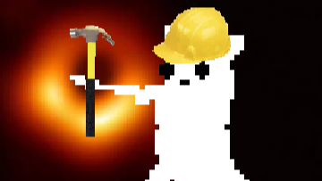

## You are seeing the version of CRS for Rain World v1.9 / Downpour, for the legacy version (v1.5), please visit [here](https://github.com/Garrakx/Custom-Regions)!
***
# Custom Regions Support (CRS)
***
## Adds various meta features to Custom Regions

## Index
1) [Debugging](#DEBUG)
2) [Procedural Music](#MUSIC)
3) [Region Landscape Art](#LANDSCAPE)
4) [Level Unlocks](#UNLOCKS)
5) [Pearls](#PEARLS)
6) [MetaProperties](#META)
7) [Region Conditional Lines](#CONDITIONALS)
8) [ReplaceRoom](#REPLACE)

### How to compile
(for coders only)
1. Place references in "lib" folder

Creating the System Variable:
2. type env in the windows search bar, 
3. choose the first one
4. Press n
5. add a new system variable called `RainWorldDir`

## <a name="DEBUG">Debugging

CRS adds better debugging support when region inevitably break.  
Its log file generates in StreamingAssets\crsLog.txt  
This will contain a lot of potentially useful info, including exception messages that the base game fails to catch.

## Procedural Music
Procedural music files can be loaded from .ogg files in music\procedural  
These files must have a sample rate of 44.100 kHz  
The filenames can also be appended with a slugcat's name in order to load slug-specific threat themes  
Read [this wiki page](https://rainworldmodding.miraheze.org/wiki/Threat_Music_File_Format) for more specific instructions on threat file formatting.

## Region Landscape Art
Region landscapes go in `Scenes\Landscape - XX`  
Inside this folder, a file called `Landscape - XX.txt` will define the landscape.  

### Layers
Format for each layer is as follows:  

    ImageName : depth : shader
    
The ImageName must be the name of a .png file (without the extension) inside `Scenes\Landscape - XX`  
The Depth is any number, and used to set how far back the image is.  
The Shader is the name of a shader type to apply to the image. The following shaders are supported:
- Normal
- Basic
- Lighten
- LightEdges
- Rain
- Overlay
- Multiply
- SoftLight

Both the Depth and Shader fields are optional, and can be omitted, defaulting to Depth of 1 and Shader of Normal. The Depth can't be omitted if the Shader field is used, however.  

    SI_Landscape - 5 : 15
    SI_Landscape - 4 : 6
    SI_Landscape - 3 : 2.2
    SI_Landscape - 2 : 0.9 : LightEdges
    SI_Landscape - 1 : 0.4

The images should be listed in draw order, with the foremost images listed last.  

### Focus Attributes

The following additional attributes of the landscape scene can be defined:
- blurMin (default 0.25)
- blurMax (default 0.8)
- idleDepths (if none are defined, all layers will be treated as idleDepths)

These control the 'focus' attributes of the landscape scene. The scene's focus will move between any idleDepths at random, and the closer a layer is to the current focus point, the less blurred it will be. Blur always ranges from 0 (no blur) to 1 (full blur,) but changing the min\max outside of this range can be useful.  

    HR_Landscape - 6 : 11
    HR_Landscape - 5 : 6.5 : LightEdges
    HR_Landscape - 4 : 4.8 : Basic
    HR_Landscape - 3 : 2.4 : Basic
    HR_Landscape - 2 : 1.1 : Lighten
    HR_Landscape - 1 : 1 : Basic
    
    blurMin : -0.1
    blurMax : 0.4
    idleDepths : 11
    idleDepths : 6.5
    idleDepths : 4.8
    idleDepths : 8
    
### Positions

Positions.txt can be included inside `Scenes\Landscape - XX` to define the positions of each layer. This file is automatically generated when [repositioning the layers using devtools](https://rainworldmodding.miraheze.org/wiki/Dev_Tools#Menu_controls) which is strongly recommended over manually writing Positions.txt

### Flat Mode

`Scenes\Landscape - XX` should also include a flat version of the region art called `Landscape - XX - Flat.png` that will be used for low performance settings.

### Title Text

Title images should be placed in the `Illustrations` folder named `Title_XX.png` and `Title_XX_Shadow.png` which will be loaded as the main text for the region.

### Menu Icon

Various menus such as the Safari menu or the Background menu use smaller icons for the regions. These go in `Illustrations` and are called `Safari_XX.png`. They should be 200x200 pixels with rounded edges.

## Level Unlocks
Level unlocks are read from  CustomUnlocks.txt.  
Format is as follows:  

    TokenID : ArenaName1, ArenaName2, ArenaName3, ect.  
    

The TokenID must be unique,  
so it's good to pick a name that won't be likely to be picked  
by another region mod.  

Since this a single file,  
region mods should extend this file with modification files.  

As an example: 

    aetherridge\modify\CustomUnlocks.txt
        [ADD]AR1 : Station, Complex, Floor
        [ADD]AR2 : Exhaust, Array, Research
        [ADD]AR3 : Aeolian, Hull, Decay
    
## Pearls
Custom Pearl data is read from  CustomPearls.txt.  
Format is as follows:  

    PearlID : MainColor : HighlightColor : ConversationFileName  
    
The PearlID must be unique,  
so it's good to pick a name that won't be likely to be picked  
by another region mod.  

Conversation files go inside Text\text_eng\  
and can have any filename,  
as long as it matches what's in CustomPearls.txt  

Since this a single file,  
region mods should extend this file with modification files.  

As an example: 

    aetherridge\modify\CustomPearls.txt
        [ADD]AR_Ridge_Pearl_1 : f56942 : e1603b : AR_Tram
        [ADD]AR_Ridge_Pearl_2 : e805e8 : ff72ff : AR_Picture
        [ADD]AR_Heat_Pearl : a6f781 : 7bff39 : AR_Shipping
        
    aetherridge\Text\text_eng\
        AR_Tram.txt
            0-46
            First line of the first text box.<LINE>Second line of the first text box.
            This line will be shown in a second text box!
            
        AR_Picture.txt
            0-118
            The 2nd number in the 1st line can be any number
            Although both numbers still need to be there
            
        AR_Shipping-Artificer.txt
            0-0
            You can also append a slugcat name
            For slug-specific conversations

## MetaProperties
A new file called MetaProperties.txt can be placed in World\XX to define the following meta properties for the region:
* **Add Region to Story Regions (used for Wanderer requirements)**  
* **Add Region to Optional Regions (visitable and has Safari menu)**  
* **Remove Region from Safari Menu (active by default)**  

Proper useage goes like this:  

    White,Yellow,Rivulet : Story  
    Gourmand,Hunter : Optional  
    Safari  

The region will only be a part of the passage requirements for  
Survivor, Monk, and Rivulet  
but Hunter and Gourmand will be able to visit and passage to it  
And the region will appear in the Safari menu  

You can also use X- syntax from the world file  

    X-Saint : Story  

This is available to every slugcat except Saint  

To make a region a story region for every slugcat, simply write

    Story  

Same goes for optional regions.  

    Optional

Safari can't have slugcat conditional syntax,  
as it uses Story\Optional regions for slug-accessibility.  

## Region Conditional Lines 
A line can be excluded if it doesn't match defined conditions.  
The current available conditions are:  
- Is MSC enabled?  
- Is a specific region acronym present?  
- Is a specific modID active?  

The formatting looks like this  

    {MSC}SU_C04 : SU_CAVE01, SU_PC01, SU_A41
    {!MSC}SU_C04 : DISCONNECTED, SU_PC01, SU_A41

Put an ! anywhere in the condition to invert it  
which in this case makes the 1st line happen if MSC is active  
and the 2nd line happen if MSC is not active  

Conditions can be stacked, like so  

    //this line happens if AR is a region but TR isn't
    {AR,!TR} 
    
    //this line happens if MSC isn't active and PC is a region
    {!MSC,PC} 
    
    //# is used as the first character to mark it as an id
    {#!lb-fgf-m4r-ik.coral-reef} 
    
    //all of these can be applied to creatures as well
    //useful for soft creature dependencies
    {#lb-fgf-m4r-ik.coral-reef}OS_D09 : 3-Polliwog-2
    {#!lb-fgf-m4r-ik.coral-reef}OS_D09 : 3-Salamander
    
    //when combined with slug conditions, the slugcat should come first
    (White,Yellow){MSC}VI_A19 : 2-Yeek-3
    (White,Yellow){!MSC}VI_A19 : 2-CicadaB-3

## ReplaceRoom

A new conditional link can be used to replace the room files for a particular room for a specific slugcat.

    CONDITIONAL LINKS
    Saint : REPLACEROOM : SU_B14 : SU_B14SAINT
    END CONDITIONAL LINKS

The room will still be known internally as its original name, but the files will be loaded by the new room name instead. So all connections and spawns should not use the new room name and still use the old one.